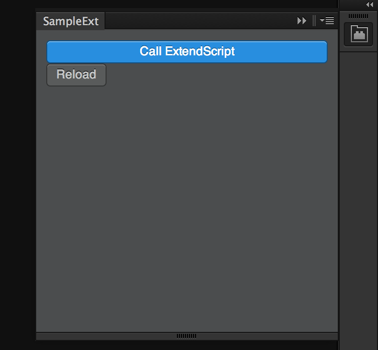

# SampleExt
Sample extention for Photoshop.

## Setup debug environment
1. Edit plist file:  `<user>/Library/Preferences/com.adobe.CSXS.5.plist`

        Set string value for the key PlayerDebugMode to 1

1. Force-reloading property list files. (in OS X 10.9)

        $ sudo killall cfprefsd

## Build extension
1. Install package.

        $ npm install

1. Edit Gruntfile.coffee and change 'user'.

        dest: '/Users/<user>/Library/Application Support/Adobe/CEPServiceManager4/extensions/com.example.sampleext'

1. Build & Run

        $ grunt

## Debug
- Open [http://localhost:8088/](http://localhost:8088/) in browser.

## References
- [Adobe-CEP/CEP-Resources](https://github.com/Adobe-CEP/CEP-Resources)
- [CEP 5 Super mega guide: Extending Adobe apps with HTML5+Node.js | // andy hall](http://aphall.com/2014/08/cep-mega-guide-en/)

## LICENSE
Copyright (C) more_more_for.
This software is released under the MIT License.
